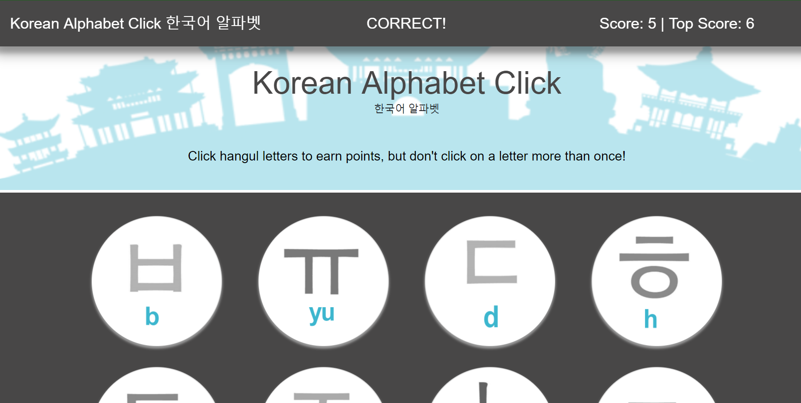

# Korean Alphabet Click

### Overview

This app is a memory game with React. This project required breaking up the application's UI into components, manage component state, and respond to user events. 

Play the game here:  https://hangul-click.herokuapp.com/ 

1. This is a React application.

2. The application renders different images to the screen. Each image listens for click events.  (These images are styled like typewriter buttons - they look great!)

3. The application tracks the user's score. The user's score is incremented when clicking an image for the first time. The user's score is reset to 0 if the same image is clicked more than once.

4. Every time an image is clicked, the images rendered to the page should shuffle in a random order.

5. After an incorrect guess, the game restarts.

